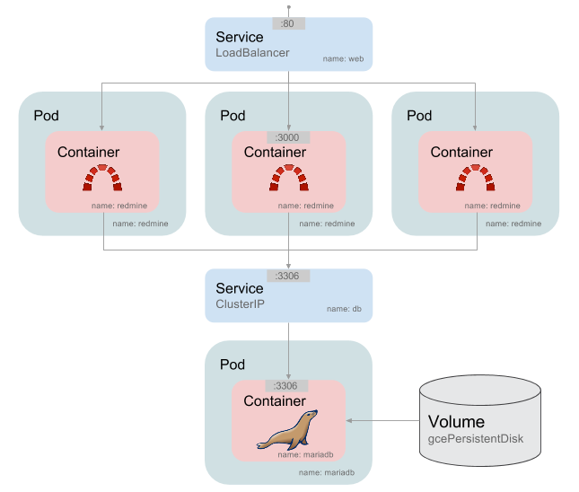

# Multi-tier application on Kubernetes

## Requirements

The same than [before](../1_first_deploy/README.md#requirements).

## Description

In this exercise, we are going deploy a more complex application, [redmine](http://www.redmine.org/) with [mariaDB](https://mariadb.org/) as database.


### Two pods

This time, we have two pods: one for the application and another one for the database.

Also, since we want Kubernetes to control failures, we are creating [replication controllers](http://kubernetes.io/v1.1/docs/user-guide/replication-controller.html) instead of simple pods.

### Two services

We are also using two [services](http://kubernetes.io/v1.1/docs/user-guide/services.html), one for the web part (which is public) and another one for the database (which is private).

### A volume

We need a [volume](http://kubernetes.io/v1.0/docs/user-guide/volumes.html) to persist data in the database. We are going to use a _gcePersistentDisk_ as support for that volume.

## Complete the template

In this folder you have templates for the redmine replication controller (`redmine-rc.yml`)[./redmine-rc.yml], mariadb replication controller (`mariadb-rc.yml`)[./mariadb-rc.yml], redmine web service (`web-service.yml`)[./web-service.yml] and db service (`db-service.yml`)[./db-service.yml]. Those templates are not complete, they have some blanks parameter to fill (`<FILL_THIS>`).

Try to fill the remaining parameters (`<FILL_THIS>`) by yourself and make the application work.

### Got stuck? Here you have the solution

- [redmine rc](https://github.com/bitnami/kubernetes-workshop/blob/you-are-not-here/hands-on/2_multitier_app/redmine-rc.yml)

- [mariadb rc](https://github.com/bitnami/kubernetes-workshop/blob/you-are-not-here/hands-on/2_multitier_app/mariadb-rc.yml)

- [web service](https://github.com/bitnami/kubernetes-workshop/blob/you-are-not-here/hands-on/2_multitier_app/redmine-service.yml)

- [db service](https://github.com/bitnami/kubernetes-workshop/blob/you-are-not-here/hands-on/2_multitier_app/mariadb-service.yml)

```
wget https://raw.githubusercontent.com/bitnami/kubernetes-workshop/you-are-not-here/hands-on/2_multitier_app/redmine-rc.yml
wget https://raw.githubusercontent.com/bitnami/kubernetes-workshop/you-are-not-here/hands-on/2_multitier_app/mariadb-rc.yml
wget https://raw.githubusercontent.com/bitnami/kubernetes-workshop/you-are-not-here/hands-on/2_multitier_app/redmine-service.yml
wget https://raw.githubusercontent.com/bitnami/kubernetes-workshop/you-are-not-here/hands-on/2_multitier_app/mariadb-service.yml
```

## Create new replicas



You can change the number of replicas in a replication controller in two ways:

- __Editing the replication-controller definition__: open the yaml file and change the property `replicas` to the desired value. Apply the changes: `kubectl apply -f <yaml of the rc>`
- __Using a command__: `kubectl scale --replicas=COUNT rc <name of the rc>`


Scale your running application by making replicas of the redmine pod.


Did it work?
